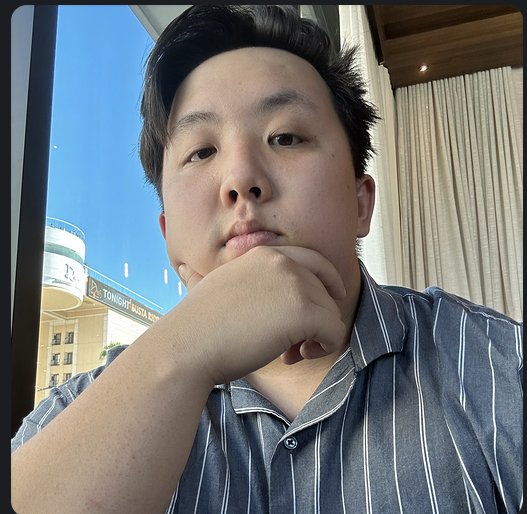
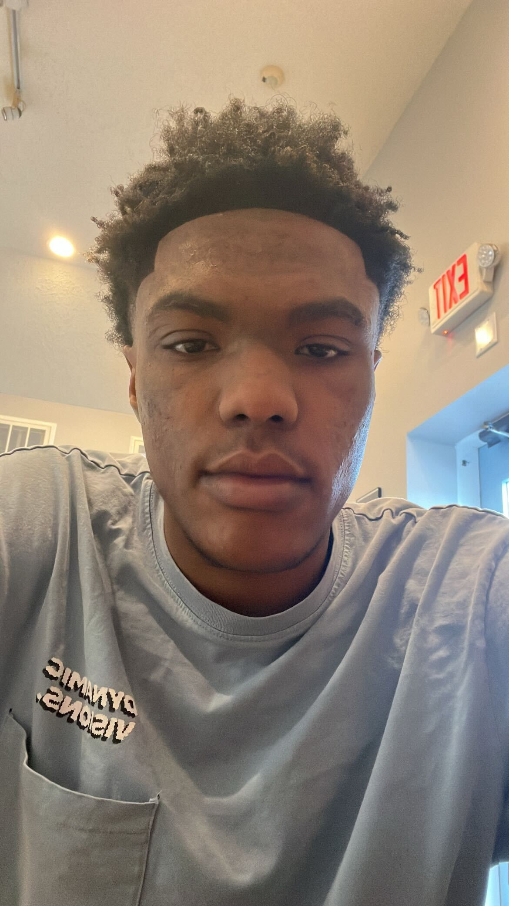

# projectTwo
This is a full-stack project and will be our 2nd graded project.

This app is called an Event Calendar!

It is a front end application designed to help you organize your events and also keep track of anything going on. It features an updated calendar along with a feature catered torwards a quick and simple event organization system. The calendar is a base template that can be customized for any event specific qualities and allows room to have features added onto with it's sleek and simple design.

List of team members:

David LeJustin AdamsJordan Morgan

